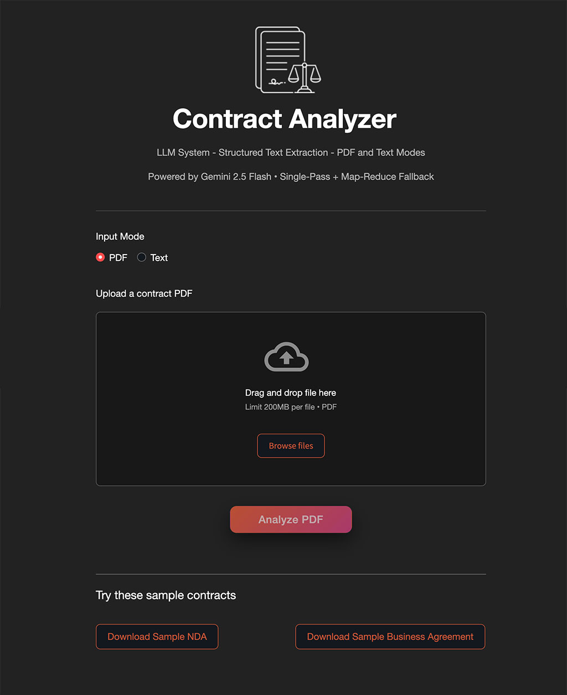

# llm-systems
A collection of production-oriented LLM projects focused on structured extraction, reliability, and applied AI system design.

This repository demonstrates practical large language model engineering beyond prompt experimentation — including adaptive pipelines, schema validation, fallback strategies, and user-facing applications.

## Projects

Projects are located in the `projects` folder. 

### 1. Contract Analyzer
Project folder: `projects/contract_analyzer`

A structured contract analysis system for PDF and text inputs.

Features:
- Single-pass and Map-Reduce processing
- Adaptive fallback logic
- Structured JSON extraction
- Risk flag detection with severity scoring
- Production-ready UI

## Design Philosophy

These projects emphasize:
- Reliability over novelty
- Structured outputs over free-form text
- Guardrails and fallback strategies
- Real-world usability
- Clean, deployable interfaces

Each system is built to reflect how LLM-powered applications should behave in production environments.

## Core Capabilities Demonstrated

Prompt engineering for structured extraction
- Map-Reduce document processing
- Schema validation and JSON enforcement
- Token-aware system design
- PDF ingestion and preprocessing
- Confidence scoring and metadata reporting
- UX considerations for AI applications

## Tech Stack
- Python
- Streamlit
- Gemini API (provider-agnostic architecture)
- pypdf
- Environment-based configuration

## Purpose

This repository serves as:
- A demonstration of applied LLM systems engineering
- A portfolio of deployable AI-backed applications
- A foundation for contract and enterprise AI work
