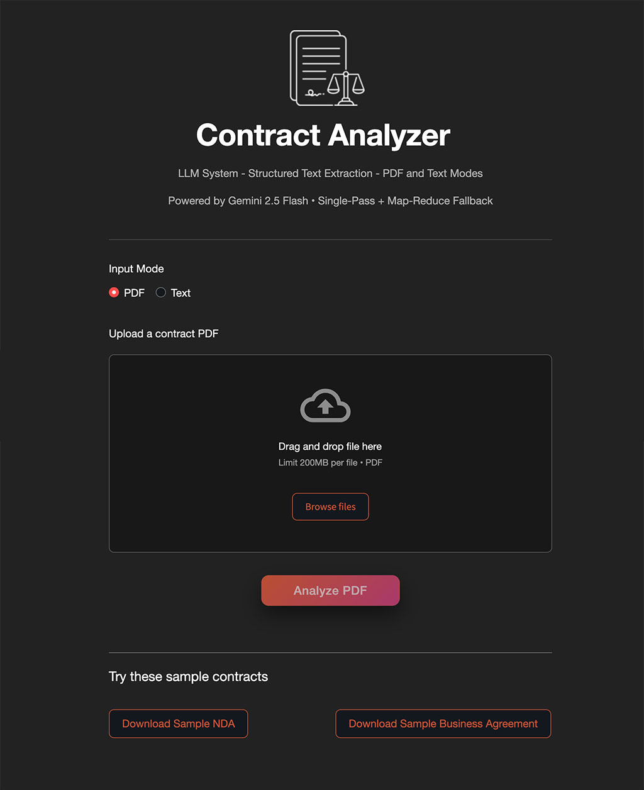

# llm-systems
A collection of production-oriented LLM projects focused on structured extraction, reliability, and applied AI system design.

This repository demonstrates practical large language model engineering beyond prompt experimentation — including adaptive pipelines, schema validation, fallback strategies, and user-facing applications.

## Projects

Projects are located in the `projects` folder. 


## Project 1: Contract Analyzer
Project folder: `projects/contract_analyzer`




Contract Analyzer is a production-style LLM system that analyzes contract text using a tool-driven workflow:
**clause extraction → rubric-based risk scoring → structured recommendations.**

It ships with two entrypoints:
- **Streamlit UI**: (PDF/text extraction + interactive review)
- **FastAPI service**: (POST /analyze for integration)


### Features:
- Single-pass and Map-Reduce processing
- Adaptive fallback logic
- Structured JSON extraction
- Risk flag detection with severity scoring
- Production-ready UI
- Gemini-powered agent loop with multi-step orchestration
- Tooling layer (clause extraction + risk rubric scorer)
- Rubric-based risk scoring with rationale, assumptions, and recommended edits
- Strict JSON output with robust parsing + retry safeguards
- FastAPI service (POST /analyze, GET /health) + Swagger docs
- CLI interface for local testing and batch workflows


### Design Philosophy

These projects emphasize:
- Reliability over novelty
- Structured outputs over free-form text
- Guardrails and fallback strategies
- Real-world usability
- Clean, deployable interfaces

Each system is built to reflect how LLM-powered applications should behave in production environments.


### Flow

- **Input**: PDF or raw text
- **Extraction** (Streamlit): PDF → text
- **Analysis core**: agent loop (tools → rubric → JSON)
- **Output**: structured JSON (+ UI rendering)

### Run It
#### Streamlit (UI)
Run the following command from the `llm-systems` root folder:

```
streamlit run projects/contract_analyzer/app/main.py
```

#### FastAPI (API)
First, start the server:

```
uvicorn src.app.server:app --reload --host 0.0.0.0 --port 8000
```

Next, make an API request:
```
curl -X POST http://localhost:8000/analyze \
  -H "Content-Type: application/json" \
  -d '{
    "contract_text": "Limitation of Liability: Vendor shall have unlimited liability. This Agreement may be terminated for convenience without notice.",
    "context": {"party_role":"vendor","jurisdiction":"California, USA","contract_type":"Software Services Agreement"}
  }'
```


### Core Capabilities Demonstrated

Prompt engineering for structured extraction
- Map-Reduce document processing
- Schema validation and JSON enforcement
- Token-aware system design
- PDF ingestion and preprocessing
- Confidence scoring and metadata reporting
- UX considerations for AI applications


### Tech Stack
- Python
- Streamlit
- Gemini API (provider-agnostic architecture)
- pypdf
- Environment-based configuration

### Purpose

This repository serves as:
- A demonstration of applied LLM systems engineering
- A portfolio of deployable AI-backed applications
- A foundation for contract and enterprise AI work

---

## Project 2: DocQuery
Project folder: `projects/doc_query`


DocQuery is a production-style Retrieval-Augmented Generation (RAG) system that allows users to upload documents, ask questions, and receive grounded answers with citations.

The system ingests documents, converts them into embeddings, retrieves relevant chunks using semantic search, reranks them for relevance, and generates answers using a large language model.


### Features:
- Document ingestion (PDF, TXT, Markdown)
- Automatic text extraction
- Document chunking with overlap
- Embedding generation
- FAISS vector search
- Top-K retrieval
- Semantic reranking
- Grounded answer generation
- Citations with page numbers and snippets
- Streamlit user interface
- FastAPI backend
- Request logging and latency tracking


### How It Works

#### Step 1 — Ingestion

Documents are uploaded and processed:
- Text is extracted from PDF/TXT/MD files
- Text is split into chunks with overlap
- Each chunk is converted into an embedding
- Embeddings are stored in a FAISS index
- Metadata is stored for citations

#### Step 2 — Retrieval

When a user asks a question:
- The question is converted into an embedding
- FAISS retrieves the Top-K most similar chunks


#### Step 3 — Reranking

Retrieved chunks are reranked based on semantic relevance to improve answer quality.


#### Step 4 — Grounded Generation

The top reranked chunks are sent to the LLM, which generates an answer grounded only in the retrieved context.


#### Step 5 — Citations

The system returns:
- Final answer
- Whether the answer is grounded
- Citations (document, page, snippet)
- Retrieved chunks
- Latency metrics


### Running the App

Run the following command from the `llm-systems` root folder:

```
streamlit run projects/doc_query/app/app.py
```

## Core Capabilities Demonstrated

This project demonstrates the ability to build production-style LLM systems, not just prototypes.

Key engineering concepts demonstrated:
- Retrieval-Augmented Generation (RAG)
- Vector databases
- Semantic search
- Reranking pipelines
- Grounded LLM generation
- API design for LLM systems
- End-to-end AI application architecture

This type of system is commonly used in:
- Enterprise knowledge assistants
- Legal document analysis
- Customer support automation
- AI search systems
- Internal company documentation Q&A


### Tech Stack
| Component    | Technology                               |
| ------------ | ---------------------------------------- |
| LLM          | Gemini 2.5 Flash                         |
| Embeddings   | Gemini embedding-001                     |
| Vector Store | FAISS                                    |
| Backend API  | FastAPI                                  |
| Frontend UI  | Streamlit                                |
| Language     | Python                                   |
| Logging      | Structured logging with latency tracking |

