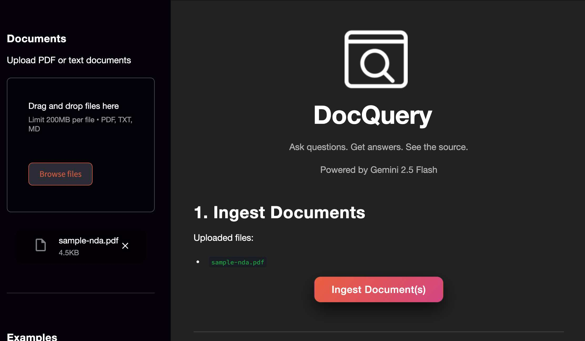

# DocQuery — Production-Style RAG System




---

## Overview

DocQuery is a production-style Retrieval-Augmented Generation (RAG) system that allows users to upload documents, ask questions, and receive grounded answers with citations.

The system ingests documents, converts them into embeddings, retrieves relevant chunks using semantic search, reranks them for relevance, and generates answers using a large language model.


It is designed to demonstrate a complete end-to-end LLM application architecture, including ingestion, retrieval, reranking, grounded generation, API exposure, and a user interface.

This project simulates a real-world use case such as:
- Internal knowledge base assistant
- Contract/document analysis assistant
- Enterprise document Q&A system
- AI search over PDFs and text documents


## Architecture

### Pipeline
```
User Question
    ↓
Embedding Model
    ↓
FAISS Vector Search (Top-K Retrieval)
    ↓
Reranking (Semantic Relevance)
    ↓
Top Chunks Selected
    ↓
LLM Generation (Grounded on Context)
    ↓
Answer + Citations
```

### Tech Stack

| Component    | Technology                               |
| ------------ | ---------------------------------------- |
| LLM          | Gemini 2.5 Flash                         |
| Embeddings   | Gemini embedding-001                     |
| Vector Store | FAISS                                    |
| Backend API  | FastAPI                                  |
| Frontend UI  | Streamlit                                |
| Language     | Python                                   |
| Logging      | Structured logging with latency tracking |


## Features
- Document ingestion (PDF, TXT, Markdown)
- Automatic text extraction
- Document chunking with overlap
- Embedding generation
- FAISS vector search
- Top-K retrieval
- Semantic reranking
- Grounded answer generation
- Citations with page numbers and snippets
- Streamlit user interface
- FastAPI backend
- Request logging and latency tracking


## Project Structure
```
docquery/
│
├── src/
│   ├── api/                # FastAPI endpoints
│   ├── ingest/             # Document ingestion pipeline
│   ├── retrieval/          # Vector search and retrieval logic
│   ├── reranker/           # Reranking logic
│   ├── generation/         # LLM answer generation
│   ├── models/             # Data models
│   ├── vector_store/       # FAISS index management
│   ├── config/             # Settings and configuration
│   └── utils/              # Utility functions
│
├── data/
│   ├── raw/                # Uploaded documents
│   ├── processed/          # Chunked documents
│   └── index/              # FAISS index
│
├── app.py                  # Streamlit UI
├── cli.py                  # Command-line client
├── main.py                 # FastAPI app
├── requirements.txt
└── README.md
```


## How It Works

### Step 1 — Ingestion

Documents are uploaded and processed:
- Text is extracted from PDF/TXT/MD files
- Text is split into chunks with overlap
- Each chunk is converted into an embedding
- Embeddings are stored in a FAISS index
- Metadata is stored for citations

### Step 2 — Retrieval

When a user asks a question:
- The question is converted into an embedding
- FAISS retrieves the Top-K most similar chunks


### Step 3 — Reranking

Retrieved chunks are reranked based on semantic relevance to improve answer quality.


### Step 4 — Grounded Generation

The top reranked chunks are sent to the LLM, which generates an answer grounded only in the retrieved context.


### Step 5 — Citations

The system returns:
- Final answer
- Whether the answer is grounded
- Citations (document, page, snippet)
- Retrieved chunks
- Latency metrics


## Setting Up the Project
```
git clone <repo-url>
cd llm-systems
python -m venv .venv
source .venv/bin/activate
pip install -r requirements.txt
```

### Create `.env`:
First, create the `.env` file by running the following command:

```
cp .env.example .env
```
Next, add you `GEMINI_API_KEY` to the `.env` file.

```
GEMINI_API_KEY='your_api_key_here'
```

## Running the App
### Streamlit (UI)
Run the following command from the `llm-systems` root folder:

```
streamlit run projects/doc_query/app/app.py
```

## Example Questions

You can test DocQuery with questions such as:
- What are the parties in this agreement?
- What is the effective date of the agreement?
- What is considered confidential information?
- How long do confidentiality obligations last?
- What law governs this agreement?


## Why This Project Matters

This project demonstrates the ability to build production-style LLM systems, not just prototypes.

Key engineering concepts demonstrated:
- Retrieval-Augmented Generation (RAG)
- Vector databases
- Semantic search
- Reranking pipelines
- Grounded LLM generation
- API design for LLM systems
- End-to-end AI application architecture

This type of system is commonly used in:
- Enterprise knowledge assistants
- Legal document analysis
- Customer support automation
- AI search systems
- Internal company documentation Q&A


## Future Improvements

Potential enhancements:
- Hybrid search (keyword + semantic)
- Cross-encoder reranking
- Conversation memory
- Multi-document citations
- Highlight answers in source document
- User authentication
- Deployment to cloud (AWS/GCP/Azure)
- Replace FAISS with a hosted vector database
- Add evaluation metrics for retrieval quality

